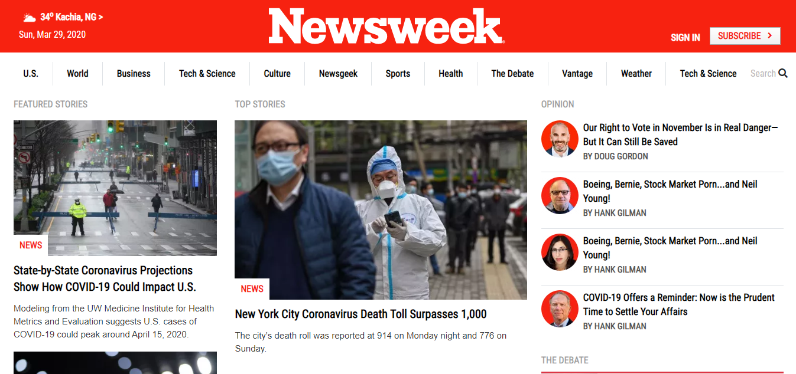

# The News Week Project
This project uses twitter’s Bootstrap framework to build a site.

This project shows the format of designing a responsive webpage using bootstrap 4 classes which has in-built media queries with different breakpoints, for smaller devices, medium devices and large screen devices, this project is set up with the latest design and development standards using BootstrapCDN, provided for free by the folks at StackPath.  Bootstrap is developed mobile first, it employs a handful of important global styles and settings which makes the page responsive when the appropriate classes are used. 

## Built With

- HTML, Bootstrap 4, CSS
- vscode

## Live Demo

[Live Demo Link](https://rawcdn.githack.com/okikiola11/newsweek-bootstrap/56063e3e447925acc7defb5a7766134b0ec8aeaa/index.html)

## Getting Started

To get a local copy up and running follow these simple example steps.

### Prerequisites
- Web browser
- Code editor
- Git and Github

### Usage
- Clone the project to your local machine 
- Open the index file in your browser

## Authors

- Okikiola Apelehin

👤 **Author1**

- Github: [okikiola apelehin](https://github.com/okikiola11)
- Twitter: [okikiola apelehin](https://twitter.com/Kikiolla3)
- Linkedin: [okikiola apelehin](https://www.linkedin.com/in/okikiola-apelehin-459008122/)

## 🤝 Contributing

Contributions, issues and feature requests are welcome!

Feel free to check the [issues page](issues/).

## Show your support

Give a ⭐️ if you like this project!

## Acknowledgments

- Google

## 📝 License

This project is [MIT](lic.url) licensed.
